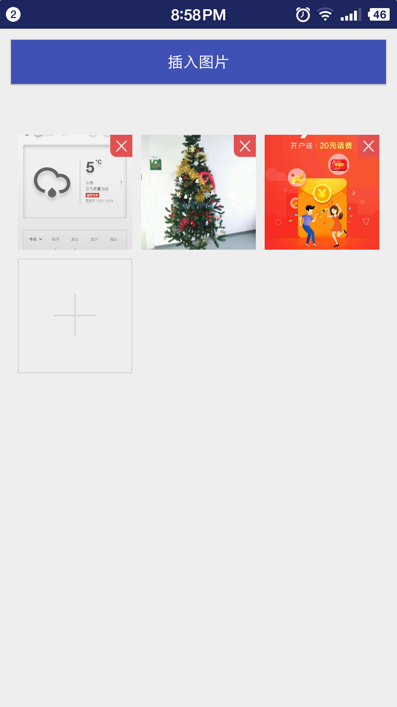

# 图片选择器实现思路（参考微信，朋友圈图片选择器）


## 效果图




##  首页已选择图片的预览界面

  * recyclerview，点击后面的图片选择页面后把图片地址通过数组传递过来，然后加载rv上。
  * 点击item进入预览界面、长按item拖动位置、点击加号选择或者拍照；
  * recyclerview的item绑定，什么时候绑定图片，什么时候绑定加号；
  * 是否是gif图的判定，以及gif图片的加载；
  * 点击右上角X号，删除选中的图片；
  * 选择9张的话，隐藏加号；不够9张，显示加号；

### 预览item方形布局

[自定义方形布局](http://blog.csdn.net/future_challenger/article/details/51346476)


[MeasureSpec](https://jakkypan.gitbooks.io/trivial/content/measurespeczai_li_jie.html)

```
 @Override
    protected void onMeasure(int widthMeasureSpec, int heightMeasureSpec) {
        //onMeasure里，width和height都传递widthMeasureSpec，便可以保证为方形
        super.onMeasure(widthMeasureSpec, widthMeasureSpec);
    }
```

### 首页图片预览器需要支持的功能

* TODO: 动态设置每行显示几列，暴露出接口来


## 点击加号进入图片选择界面

  * 第一项拍照，通过传入参数来控制；
  * recyclerview item多项选择
  * 点击预览——> 预览选中的图片；
  * 点击完成——>携带选中的图片数组传过去；（只有选中图片的时候，完成按钮才可以点击）
  * 点击选择图片——> 弹出本机上的相册文件夹
  * 默认显示全部照片，选择某个具体的文件夹后，展示出当前文件夹下的图片来；

### 图片选择器界面

#### 权限申请

* 调用相机权限: *Manifest.permission.CAMERA*
* 读取外部存储权限：*Manifest.permission.READ_EXTERNAL_STORAGE*

引入第三方权限申请库，简化权限申请:

```
compile 'pub.devrel:easypermissions:0.2.1'
```

Github主页：[EasyPermissions](https://github.com/googlesamples/easypermissions)


#### 读取存储权限

* 权限申请成功后，用Fragment来加载全部数据；
* 权限申请失败后，弹出权限申请失败提示；

### 点击拍照

点击拍照后，调用相机进行拍照；重点是拍照完成后，如何处理？

 > 1. 发送通知，文件系统扫描，把照片加载到相册里；
 > 2. 直接进入微信似的浏览界面

 这个动作怎么选择？

### item多项选择

点击的条目，路径进行存储；路径的传递，以及删除；

### 点击预览

点击预览后，把选中的条目路径传递到预览界面，借助ViewPager来实现

### 点击完成

点击完成后，把选中的图片路径，传递到首页的图片预览界面；

### 点击选择图片

点击选择图片后，弹出dialog，展示出当前本机上所有的图片文件夹；再点击某一个具体的文件夹时，


